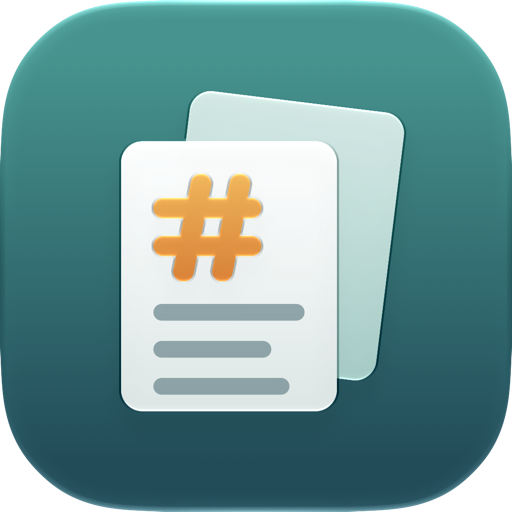
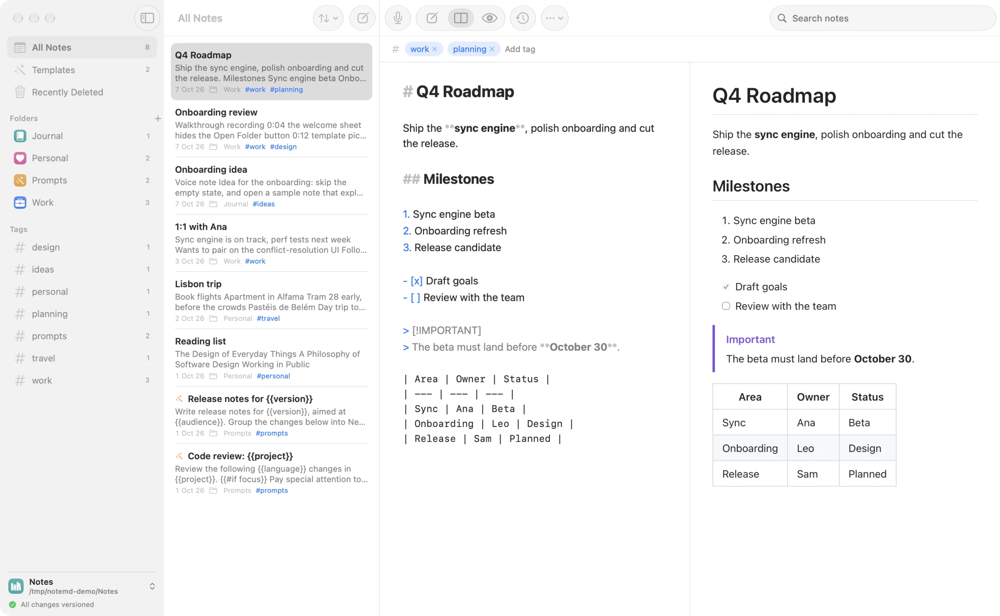
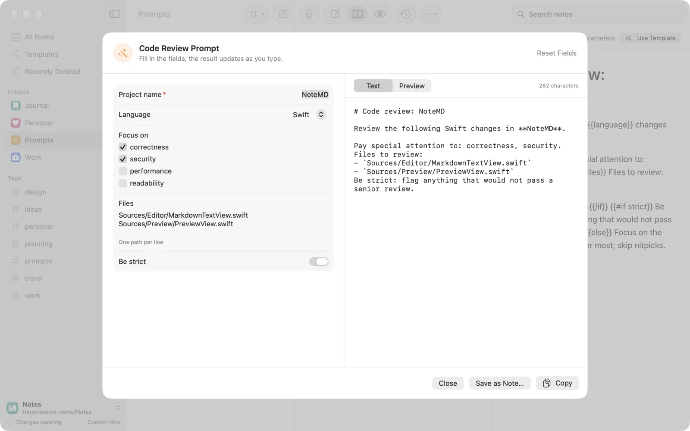
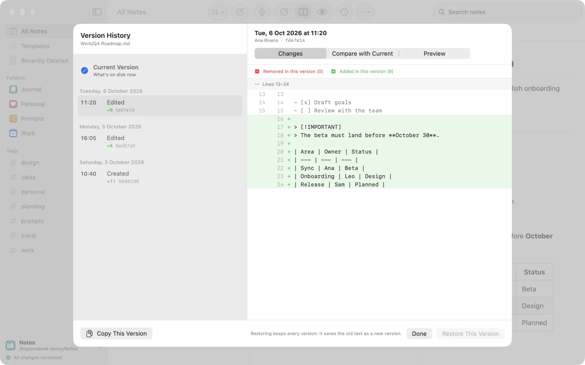
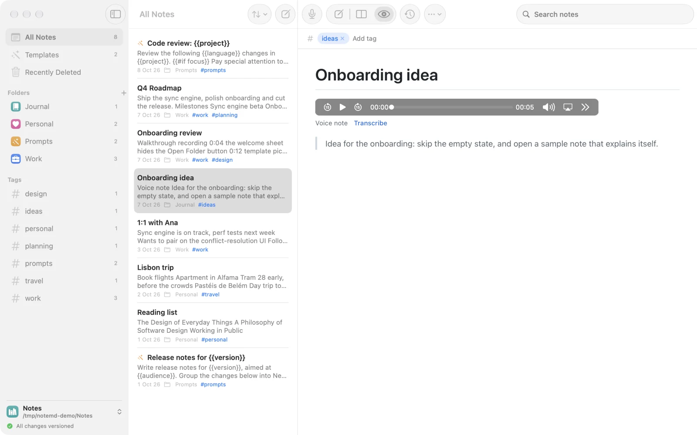
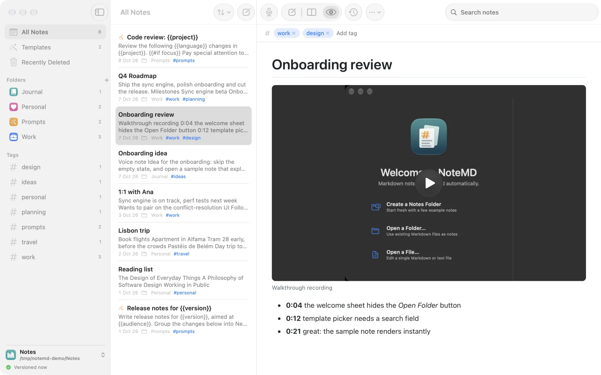

<p align="center">
  
</p>

<h1 align="center">NoteMD</h1>

<p align="center">
  <strong>Markdown notes, versioned automatically.</strong><br>
  A native macOS app for plain Markdown files, with git history, prompt templates, voice notes and a text editor for everything else.
</p>

<p align="center">
  <a href="https://itsjavi.com/notemd/">Website</a> ·
  <a href="#features">Features</a> ·
  <a href="#building">Building</a> ·
  <a href="LICENSE">MIT License</a>
</p>

<picture>
  <source media="(prefers-color-scheme: dark)" srcset="web/assets/screenshot-dark.webp">
  
</picture>

<p align="center">
  <a href="https://itsjavi.com/notemd/#video"><strong>▶ Watch the 42-second intro</strong></a>
</p>

## Why NoteMD

I wanted a simpler note-taking app: plain Markdown files, several separate vaults, and every change versioned with git
without having to think about it.

I also kept rewriting the same AI prompts, so I added templates: put parameters in a note, fill in a form, copy the
result. Voice notes and video reviews came next, because some thoughts are faster to say or show than to type.

And while I was at it, a proper editor for every other text file on my Mac. Goodbye, TextEdit.

## Features

- **Notes are files.** Any folder can be a vault. Open several at once, each in its own window, and switch between
  recent ones. No database and no proprietary format: just Markdown files in a git repository.
- **Versioned automatically.** Edits are saved as you type and committed a few seconds after you stop (configurable),
  when you close the window, on quit and with ⌘S. Version History shows what changed in each version, compares any of
  them with the current text and restores one as a new commit. Deleted notes can be restored too.
- **Templates for reusable prompts.** Add `params` to a note's front matter and use `{{name}}` placeholders, plus
  `{{#if}}`, `{{#elseif}}`, `{{#unless}}` and `{{#each}}` blocks. Conditions can compare values
  (`{{#if language == Swift}}`, `{{#if max >= 10}}`), and the parameters editor has a syntax guide one click away.
  _Use Template_ opens a form (text, long text, number, toggle, choice, multiple choice, file, folder, date and list
  fields) and gives you the result to copy or save as a note. To have an AI agent write templates for you, point it
  at the [create-reusable-prompt](skills/create-reusable-prompt/SKILL.md) skill and its front matter JSON Schema.
- **Voice notes.** Record into a note and transcribe the clip with on-device speech recognition. The transcript is added
  below the clip as a quote; the audio never leaves your Mac.
- **Attachments and video reviews.** Drag or paste images, recordings and other files into a note. They are copied into
  the vault's `assets/` folder (or linked where they are), stored with Git LFS, and audio and video play inline in the
  preview. A paperclip in the note list shows which notes have attachments and warns about broken links. The Assets
  view lists every file with where it's used, finds unused and missing ones, and renames or bins them while keeping the
  notes' links right.
- **Organize and find.** Folders with a color and an icon, tags in front matter (`tags:`), and search across titles,
  tags and text with `tag:name` / `#name` filters.
- **GitHub Flavored Markdown.** Tables, task lists, footnotes, alerts and autolinks, rendered by cmark-gfm, with Editor,
  Split and Preview modes (⌘1, ⌘2, ⌘3).
- **A text editor too.** Open any text file from Finder, whatever its extension. Markdown gets the editor and preview,
  HTML files a live preview of the page itself (scripts and remote content stay blocked until you allow them), and
  everything else opens in plain-text mode. Find and replace in any note or file (⌘F, ⌥⌘F), and line numbers and invisible
  characters (spaces, tabs, line breaks) are one click away in the View menu. NoteMD appears under _Open With_ without becoming the default app.
- **Notes from anywhere.** Create notes from other apps through the Services menu, the Dock icon, drag and drop or
  paste.

<table>
  <tr>
    <td width="50%"></td>
    <td width="50%"></td>
  </tr>
  <tr>
    <td align="center">Templates with parameters</td>
    <td align="center">Version History</td>
  </tr>
  <tr>
    <td width="50%"></td>
    <td width="50%"></td>
  </tr>
  <tr>
    <td align="center">Voice notes and transcription</td>
    <td align="center">Video reviews</td>
  </tr>
</table>

## Requirements

- macOS 26 or later on Apple silicon
- `git` (Xcode Command Line Tools or Homebrew)
- `git-lfs` for attachments (`brew install git-lfs`)
- Xcode 26 or later to build

## Building

```bash
git clone https://github.com/itsjavi/notemd.git
cd notemd
make install  # builds build/NoteMD.app and copies it to /Applications
```

Other targets: `make app` (release build only), `make run` (debug build), `make test` (unit tests).

See [AGENTS.md](AGENTS.md) for the project layout, build variants and test hooks. The website lives in [`web/`](web) and
is deployed to GitHub Pages on every push to `main` that touches it.

## License

[MIT](LICENSE)
